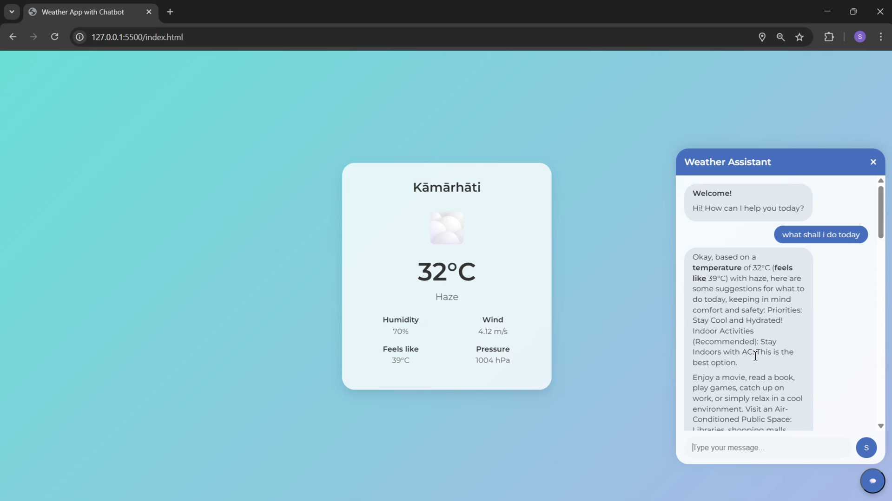

# Weather App with Chatbot

A modern, responsive weather application that displays real-time weather information based on your current location and features an integrated AI-powered chatbot assistant for weather-related queries.

## Features

- **Automatic Location Detection:** Uses your device's geolocation to fetch weather data for your current city.
- **Real-Time Weather Data:** Displays temperature, weather conditions, humidity, wind speed, pressure, and more.
- **Weather Emojis:** Visual representation of weather conditions with intuitive emojis.
- **AI Chatbot Assistant:** Ask weather-related questions and get smart, context-aware responses powered by Google Gemini API.
- **Responsive Design:** Works seamlessly on desktop and mobile devices.
- **Modern UI:** Clean, attractive interface with smooth animations and user-friendly layout.

## Screenshots

 <!-- Add your screenshot if available -->

## Prerequisites

- Modern web browser (Chrome, Firefox, Edge, Safari, etc.)
- Internet connection (for API calls)

## Installation

1. **Clone the repository:**

   ```sh
   git clone https://github.com/Shamik004/Ai-Weather-App.git
   cd Ai-Weather-App
   ```

2. **Open `index.html` in your browser.**

## Configuration

- Replace the `apiKey` in `script.js` with your [OpenWeatherMap API key](https://openweathermap.org/api).
- Replace the `geminiApiKey` in `script.js` with your [Google Gemini API key](https://aistudio.google.com/app/apikey).

## Project Structure

```text
index.html      # Main HTML file
styles.css      # App styling
script.js       # App logic and chatbot integration
readme.md       # Project documentation
```

## Usage

- On page load, the app will request your location and display the current weather.
- Click the chat button (💬) to open the chatbot and ask questions like:
  - "What should I wear today?"
  - "Is it going to rain?"
  - "How humid is it?"

## Technologies Used

- HTML5, CSS3, JavaScript (ES6)
- [OpenWeatherMap API](https://openweathermap.org/api)
- [Google Gemini API](https://aistudio.google.com/app/apikey)

## License

This project is licensed under the MIT License.

---

*Made with ❤️ by [Shamik Bardhan](https://github.com/yourusername)*
